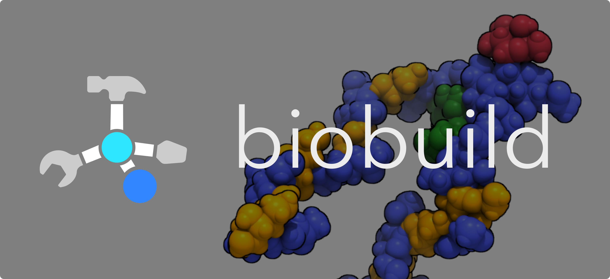
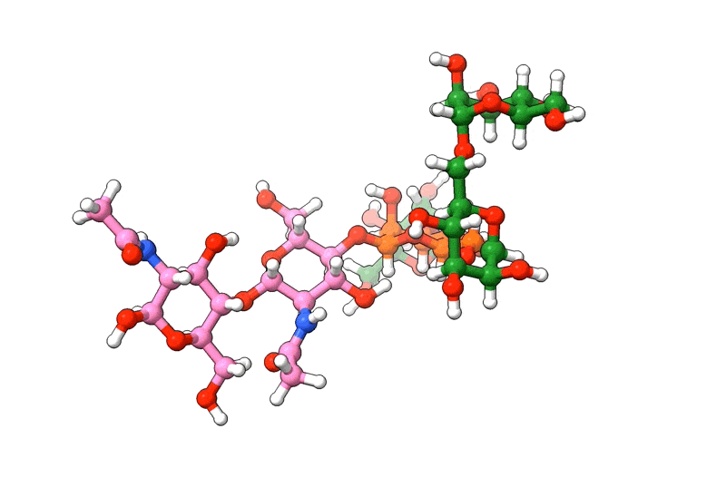

[](https://biobuild.readthedocs.io/en/latest/?badge=latest)
[](https://www.codefactor.io/repository/github/noahhenrikkleinschmidt/biobuild/overview/main)


Biobuild is a molecular building suite designed to facilitate the creation of large biomolecules such as glycans. 
It allows for an easy molecule creation process in a jupyter-notebook environment. Biobuild offers direct integrations
to [PubChem](https://pubchem.ncbi.nlm.nih.gov), and the [PDBE component library](https://www.google.com/search?client=safari&rls=en&q=pdbe+component+library&ie=UTF-8&oe=UTF-8) as well as the [CHARMM project](http://charmm-gui.org) for pre-defined component structures and linkage types.

`biobuild` allows users to:
---------------------------
- build any larger molecular structure they like
- improve the conformation of an existing structure
- convert data formats
- visualize the structures as they build them
- quickly obtain molecular structures for chemical compounds

`biobuild` cannot:
------------------
- generate circular structures (users need to choose suitable templates with rings already present)
- imitate real-life chemical reaction mechanisms
- perform molecular dynamics or quantum chemistry computations
- generate molecules _for_ the user - the user needs to know what they want to build...


Example - building a dendrimer
------------------------------

Let's build a polyphenylene dendrimer

```python
import biobuild as bb

bb.load_small_molecules()

benzene = bb.molecule("benzene")

# -----------------------------
#     make the periphery
# -----------------------------
periphery = benzene.copy()

# set up the linkage instructions
# always shifting the carbon at which to attach
link = bb.linkage("C1", "C1")
for carbon in range(1, 6):
    link.atom1 = f"C{carbon}"
    periphery.attach(benzene, link, at_residue=1)

# -----------------------------
#     assemble the molecule
# -----------------------------
mol = benzene.copy()

link2 = bb.linkage("C1", "C4")

# and attach the periphery to the core
for carbon in mol.get_atoms("C", by="element"):
    link2.atom1 = carbon
    mol.attach(periphery, link2, at_residue=1, other_residue=2)

# -----------------------------
#   optimize the conformation
# -----------------------------
mol.optimize()
mol.to_pdb("polyphenylene.pdb")
```


Example - building a glycan
---------------------------

Because Biobuild has data on glycosyidic linkages from CHARMM, we can build glycan structures from scratch by referencing the linkages from CHARMM. 

```python

import biobuild as bb

# load the sugar dataset from PDBE
bb.load_sugars()

# get the monosaccharides
# (using their PDBE identifiers)
nag = bb.molecule("NAG") # N-acetylglucosamine, a.k.a. GlcNAc
bma = bb.molecule("BMA") # beta-mannose
man = bb.molecule("MAN") # alpha-mannose

# start by connecting two NAGs together
# 'beta 1->4' glycosydic linkage is pre-defined
# in the CHARMM force field and can be used by its name '14bb' directly
glycan = bb.connect(nag, nag,  "14bb")

# add a beta-mannose to the last NAG
glycan.attach(bma, "14bb")

# add an alpha-mannose to the beta-mannose
# using an 'alpha 1->3' linkage ('13ab' in CHARMM)
glycan.attach(man, "13ab")

# add another alpha-mannose
# at the second-to-last residue (BMA)
glycan.attach(man, "16ab", at_residue=-2)

# add one final alpha-mannose
glycan = bb.connect(glycan, man, "16ab")

# now visualise the structure
glycan.show()

# and save to a PDB file
glycan.to_pdb("my_glycan.pdb")
```

