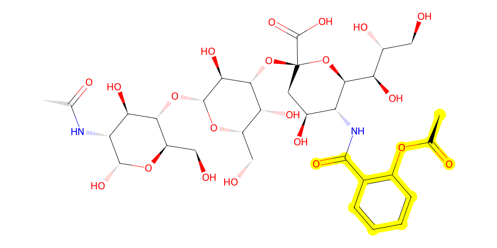

---


---

[](https://jcheminf.biomedcentral.com/articles/10.1186/s13321-024-00900-6)
[](https://doi.org/10.5281/zenodo.12581092)
[](https://python.org "Go to Python homepage")
[](https://biobuild.readthedocs.io/en/latest/?badge=latest)
[](https://biobuild.readthedocs.io/en/latest/tutorials.html)
[](https://badge.fury.io/py/buildamol)
[](https://pepy.tech/project/buildamol)
[](https://black.readthedocs.io/ "Go to Black homepage")
[](https://www.codefactor.io/repository/github/noahhenrikkleinschmidt/buildamol/overview/main)


BuildAMol is a molecular building suite designed to facilitate the generation and alteration of atomic models for large and small chemical structures.

It allows for an easy modeling process inside a Jupyter Notebook  or can be integrated into automated pipelines. BuildAMol offers direct integrations to [PubChem](https://pubchem.ncbi.nlm.nih.gov), and the [PDBE component library](https://www.google.com/search?client=safari&rls=en&q=pdbe+component+library&ie=UTF-8&oe=UTF-8) as well as the [CHARMM project](http://charmm-gui.org) to provide pre-defined template structures and linkages to use out-of-the-box. Quick-conversions to popular libraries such as [RDKit](https://www.rdkit.org) allow for a smooth workflow, going from modeling to analysis.

BuildAMol allows users to:
--------------------------
- build any larger molecular structure they like with full control
- automate molecular modeling tasks (e.g. see the [Ligand Design Pipeline](https://biobuild.readthedocs.io/en/latest/examples/ligand_design.html) or [Molecular Derivatives](https://biobuild.readthedocs.io/en/latest/examples/derivator_example.html) examples)
- improve the conformation of an existing structure
- visualize the structures as they build them
- quickly obtain molecular structures for chemical compounds
- convert data formats

BuildAMol cannot:
-----------------
- model real-life chemical reaction mechanisms
- perform molecular dynamics or quantum chemistry computations
- generate molecules _for_ the user out of the blue - the user needs to to have some idea of what to build or how to build it...


Installing BuildAMol
--------------------

BuildAMol can be installed via pip using:

```bash
pip install buildamol
```

Getting Started
---------------
BuildAMol has a comprehensive [documentation](https://biobuild.readthedocs.io/en/latest/) on ReadTheDocs. There you can find also also a number of **tutorials** to get you started on the API covering both basic operations as well as more complex and applied workflows such as building materials, preparing molecules for molecular dynamics, or designing protein ligands. 

BuildAMol Paper
---------------
To learn more about the benchmarking we did and further details on the software, please check out the [BuildAMol paper](https://jcheminf.biomedcentral.com/articles/10.1186/s13321-024-00900-6). Also, if you were using BuildAMol for your project, please cite the paper :heart:

```
@article{buildamol,
	author = {Kleinschmidt, Noah and Lemmin, Thomas},
	journal = {Journal of Cheminformatics},
	number = {1},
	pages = {104},
	title = {BuildAMol: a versatile Python toolkit for fragment-based molecular design},
	volume = {16},
	year = {2024}}
```

Example 1 - Building A Dendrimer From Scratch
---------------------------------------------
[](https://githubtocolab.com/NoahHenrikKleinschmidt/buildamol/blob/dev/docs/examples/_colab_building_polyphenylene.ipynb)


This code will model a polyphenylene dendrimer as it was originally described by [Bauer et al. (2002)](https://doi.org/10.1002/1521-3765(20020902)8:17<3858::AID-CHEM3858>3.0.CO;2-5). 
```python
import buildamol as bam

bam.load_small_molecules()

benzene = bam.molecule("benzene")

# -----------------------------
#     make the periphery
# -----------------------------
periphery = benzene.copy()

# set up the linkage instructions
# always shifting the carbon at which to attach
link = bam.linkage("C1", "C1")
for carbon in range(1, 6):
    link.atom1 = f"C{carbon}"
    periphery.attach(benzene, link, at_residue=1)

# -----------------------------
#     assemble the molecule
# -----------------------------
mol = benzene.copy()
link2 = bam.linkage("C1", "C4")

# and attach the periphery to the core
for carbon in mol.get_atoms("C", by="element"):
    link2.atom1 = carbon
    mol.attach(periphery, link2, at_residue=1, other_residue=2)

# -----------------------------
#   optimize the conformation
# -----------------------------
mol.optimize()
mol.to_pdb("polyphenylene.pdb")
```


Example 2 - Making a Glycan-Aspirin Conjugate
---------------------------------------------

There are also a bunch of already available extensions to make life easier when constructing certain kinds of molecules. For example, we can build Glycans directly from commonly used IUPAC notation. We can also exploit BuildAMol's various inference-level tools to determine how to connect molecular fragments together. In the example below we create a glycan-drug conjugate, automatically searching for the right atoms to use for connecting the molecules.

```python
import buildamol as bam
from buildamol.structural.groups import carboxyl
from buildamol.structural import constraints
from buildamol.extensions.bio import glycans

# construct a small glycan
glycan = glycans.glycan("Neu5Ac(a2-3)Gal(b1-4)GlcNAc")

# and now create a conjugate with a drug-like molecule
# e.g. aspirin
aspirin = bam.molecule("aspirin")

# find the right atoms to define a linkage 
# (here: connect the Nitrogen atom of the last sugar residue 
# to the carbonyl Carbon of the carboxyl group of aspirin, while splitting of an acetonic acid)
N = glycan.get_atom("N", by="element", residue=-1)
C_next_to_N = glycan.search_by_constraints(
	[
  		constraints.has_double_bond_with("O"),
        is_neighbor_of_N := lambda _, atom: N in glycan.get_neighbors(atom),		
	]
)[0][0]

aspirin_carboxyl_atoms = carboxyl.find_matches(aspirin, aspirin.atoms)[0]
C_of_COOH, O_of_COOH, OH_of_COOH = aspirin_carboxyl_atoms.values()

link = bam.linkage(
	N, C_of_COOH, 
	delete_in_target=[C_next_to_N], # and implicitly everything downstream
	delete_in_source=[OH_of_COOH]
)

# now create the conjugate
conjugate = bam.connect(glycan, aspirin, link)
conjugate.draw2d().highlight_residues(-1, color="yellow").draw()
```


