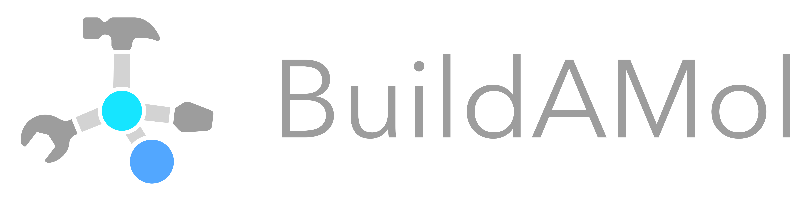
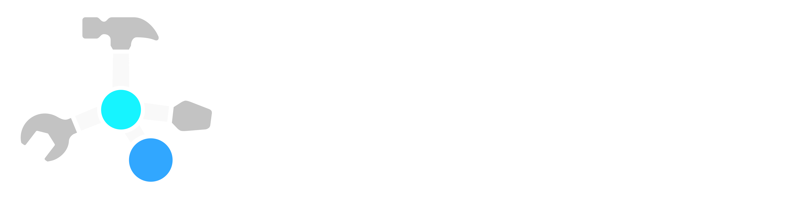

.. <gallery>

.. raw:: html

    

        
    

        
    

    

        
    

    

        
    

    

        
    

    

        
    

    

        
    

    

        
    

    

        
    

    

        
    

    

        
    

    

        
    

    

        
    

    

        
    

    

        
    

    

        
    

    

        
    

    

        
    

    

        
    

    

        
    

    

    <!-- Placeholder to maintain layout spacing -->
    

.. raw:: html

    

.. raw:: html

    

.. <gallery>

.. title:: BuildAMol
   

.. ====================================
.. Welcome to BuildAMol's documentation
.. ====================================

`BuildAMol` (formerly Biobuild) is a fragment-based molecular assembly toolkit for the generation of atomic models for complex molecular structures.
It is designed to leverage the simplicity of python-coding and the power of fragment-based assembly to provide a slim and streamlined workflow.
Based on `biopython <http://biopython.org/wiki/Main_Page>`_ and accessible as a `python package`, `BuildAMol` not only offers a straightforward API to generate, manipulate, visualize, and export 3D structures of molecules, but also provides easy interfaces with other molecular modeling tools such as `RDKit <https://www.rdkit.org/docs/index.html>`_.

.. toctree::
   :maxdepth: 2
   :caption: Contents:
   :hidden:

   whatfor
   installation
   tutorials
   documentation

.. grid:: 3

    .. grid-item-card::  Tutorials
        :link: tutorials
        :link-type: ref
        :link-alt: Tutorials

    .. grid-item-card::  API Documentation
        :link: apidocumentation
        :link-type: ref
        :link-alt: API Documentation    

    .. grid-item-card::  Extensions
        :link: buildamol.extensions
        :link-type: doc
        :link-alt: Extensions
